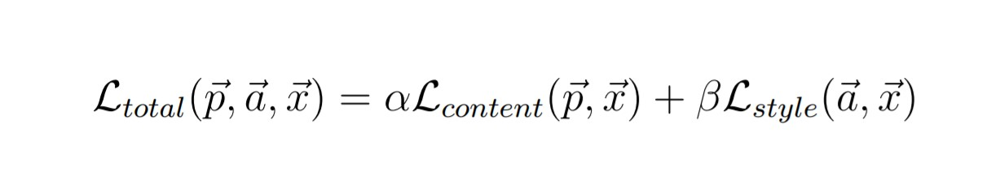

# Muralscape
A Neural Style Transfer project that takes in an image along with a style of painting , combines the two in order to produce a beautiful, ultra-realistic version that consists of the target image rendered in the desired artistic style. This is a from-the-scratch Pytorch implementation of the paper - A Neural Algorithm of Artistic Style (Gatys et al.) and can be found [here](https://arxiv.org/abs/1508.06576)

## Intuition
The VGG-19 model enables users to extract content-based information from the original input image whereas the former facilitates extraction of style or texture-based information from style image. Thus, the total loss is the combination of both content and style loss values.

## Implementation
- The model used is VGG-19 and the (Conv2d) layers used to obtain features: 0, 5th, 10th, 19th and the 28th layers, as per details mentioned in the paper A neural algorithm of artistic style.
- The input image and the style it needs to be transformed to, are fed as inputs and are preprocessed by using transforms: resizing (256x256), conversion to a tensor and normalization.
- A generated image (noise) is initialized using a clone/copy of the input image unlike random initialization for better results.
- Training was performed in mixed precision using torch.cuda.amp (FP16) and makes use of NVIDIA 1050Ti GPU with CuDNN integration.
- The model was trained for 5000 epochs on image-style pairs and the outputs of this process have been included in the "Results" section below.
- Optimizer used: Adam,
- The model is later stored as 'nst_model.pth' for easy access, under the model folder.

Final Loss:  1853 - 2000 epochs
